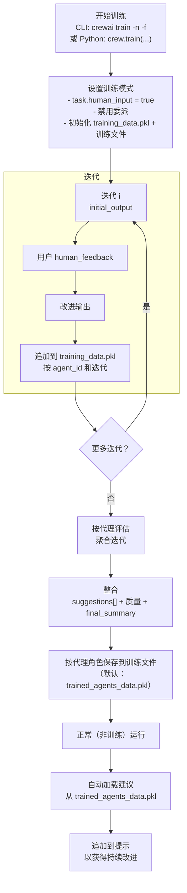

## 概述

CrewAI 中的训练功能允许您使用命令行界面（CLI）训练您的 AI 代理。
通过运行命令 `crewai train -n <n_iterations>`，您可以指定训练过程的迭代次数。

在训练期间，CrewAI 利用技术来优化您的代理性能以及人类反馈。
这有助于代理提高其理解、决策和问题解决能力。

### 使用 CLI 训练您的团队

要使用训练功能，请遵循以下步骤：

1. 打开您的终端或命令提示。
2. 导航到您的 CrewAI 项目所在的目录。
3. 运行以下命令：

```shell
crewai train -n <n_iterations> -f <filename.pkl>
```
<Tip>
  将 `<n_iterations>` 替换为所需的训练迭代次数，将 `<filename>` 替换为以 `.pkl` 结尾的适当文件名。
</Tip>

<Note>
  如果省略 `-f`，输出默认为当前工作目录中的 `trained_agents_data.pkl`。您可以传递绝对路径来控制文件的写入位置。
</Note>

### 编程训练您的团队

要编程训练您的团队，请使用以下步骤：

1. 定义训练的迭代次数。
2. 为训练过程指定输入参数。
3. 在 try-except 块内执行训练命令以处理潜在错误。

```python Code
n_iterations = 2
inputs = {"topic": "CrewAI 训练"}
filename = "your_model.pkl"

try:
    YourCrewName_Crew().crew().train(
          n_iterations=n_iterations,
          inputs=inputs,
          filename=filename
    )

except Exception as e:
    raise Exception(f"训练团队时发生错误：{e}")
```

## 训练数据如何被代理使用

CrewAI 以两种方式使用训练工件：在训练期间融入您的人类反馈，以及在训练后指导代理使用整合的建议。

### 训练数据流



### 训练运行期间

- 在每次迭代时，系统为每个代理记录：
  - `initial_output`：代理的第一个回答
  - `human_feedback`：提示时的您内联反馈
  - `improved_output`：反馈后代理的后续回答
- 此数据存储在名为 `training_data.pkl` 的工作文件中，按代理的内部 ID 和迭代键控
- 训练激活时，代理自动将您之前的人类反馈追加到其提示中，以在训练会话内的后续尝试中强制执行这些指令。
  训练是交互式的：任务设置 `human_input = true`，因此在非交互环境中运行将阻塞用户输入。

### 训练完成后

训练完成后，系统：

1. **聚合每个代理的结果**：跨所有迭代收集性能指标
2. **生成质量分数**：基于输出质量和人类反馈
3. **创建最终摘要**：每个代理学习的总结
4. **保存训练工件**：按代理角色保存到 `.pkl` 文件
5. **使训练可用于后续运行**：在正常（非训练）运行中自动加载建议

这确保训练直接转化为持续的性能改进。